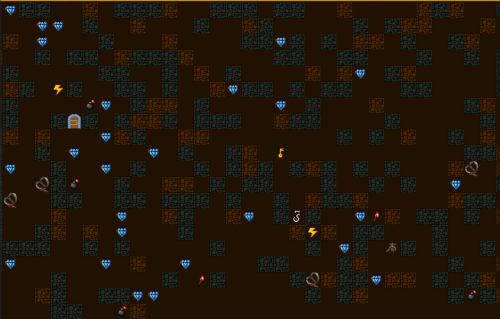

  <h1>🗡️ MAZE HUNTER 🛡️</h1>
  
<strong>¡Sobrevive, explora y escapa de las profundidades del laberinto!</strong>

 

**Maze Hunter** es una emocionante aventura de exploración y supervivencia donde asumes el rol de un cazador atrapado en un laberinto. Empleando tu astucia y diversos recursos del entorno como bombas, llaves y energía, tu objetivo será encontrar la salida antes de que tu energía/vida se agote o caigas en las trampas mortales que se encuentran en las sombras. Cada partida te ofrece una experiencia desafiante y única, invitándote a romper tus propios récords de tiempo y recolección de cristales mientras te sumerges por completo en la niebla de guerra.

Con respecto a la arquitectura del proyecto, el código de este proyecto fue diseñado pensando en una arquitectura limpia y escalable, aplicando los principios **SOLID** y haciendo uso de fuertes fundamentos de programación orientada a objetos y patrones de diseño. La estructura del pryecto aplica el patrón **MVC** para separar la lógica de la interfaz gráfica, lo que facilita la mantenibilidad y el desarrollo colaborativo. Para lograr niveles siempre impredecibles y variados, utilizamos el patrón **Strategy**, el cual nos permite alterar dinámicamente el algoritmo de generación del laberinto en tiempo de ejecución. Del mismo modo, el sonido está optimizado gracias a la implementación del patrón **Singleton** para la gestión centralizada del audio, evitando fugas de memoria y cruce de pistas. Finalmente, toda la transferencia de información y persistencia de las partidas está respaldada de forma segura por objetos **DTO** (Data Transfer Object), garantizando que tu progreso e inventario se guarden permanentemente mediante la serialización estructurada en archivos JSON.

---

## GAMEPLAY 

  <video src="src/resources/video/Gameplay.mov" autoplay loop muted playsinline width="100%"></video>

---

## MENÚ PRINCIPAL/INICIO DE SESIÓN

## INSTRUCCIONES

## JUEGO EN CURSO

## ANALES DEL TEMPLO/ESTADÍSTICAS

 

  <i>Desarrollado usando JavaFX</i>

